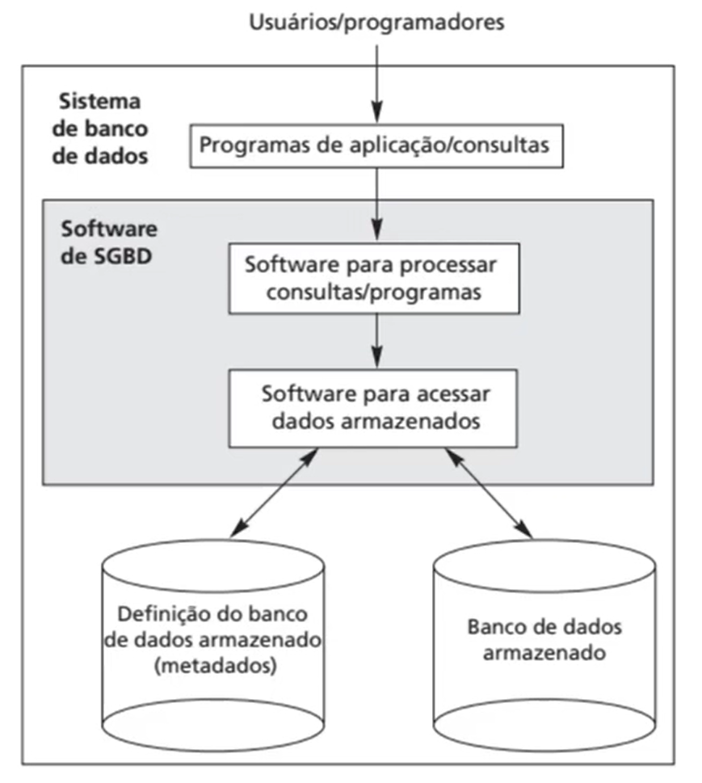
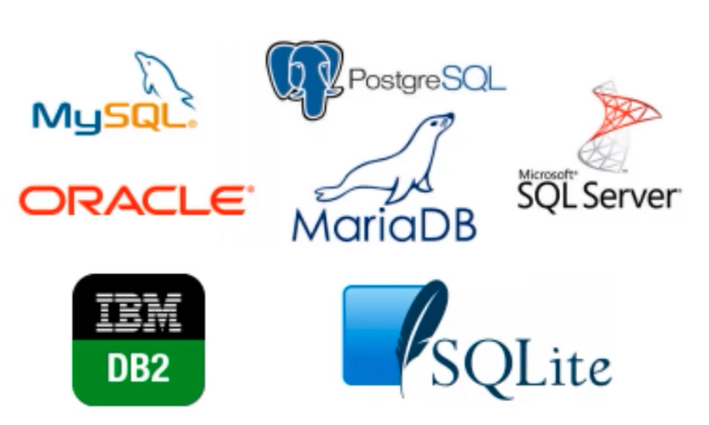

# O QUE É UM BANCO DE DADOS ?

"Coleção de dados **Relacionados**" *(Definição muito genérica)*

Porém uma coleção de palavras pode ser um Banco de Dados ?

O uso do termo Banco de Dados tem algumas propriedades explícitas:

* Representa o aspecto de algo do mundo real.
* Coleção logicamente coerente de dados.
* Projetado para uma finalidade específica.
  
 

# O QUE É UM SGDB ?

SGBD - Sistema de Gerenciamento de Banco de Dados

Sistema computacional que permite que usuários mantenham um banco de dados.

 

## SGBD - Sistema de uso geral:
 
    
    Permite definir, construir, manipular e compartilhar o banco de dados.

**Definição** - Especificar tipos, estruturas e restrições dos dados armazenados (Metadados).

**Construção** - Processo de armazenar os dados em algum meio.

**Manipulação** - Funções de consulta, recuperar dados, atualizar dados, ou seja, refletir as mudanças no mundo real.

**Compartilhamento** - Usuários e programas acessem o Banco de Dados simultaneamente.

 

 

### Exemplos de SGBD's do mercado:

 

 

# SGDB