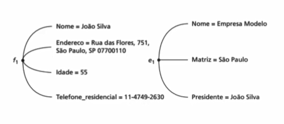
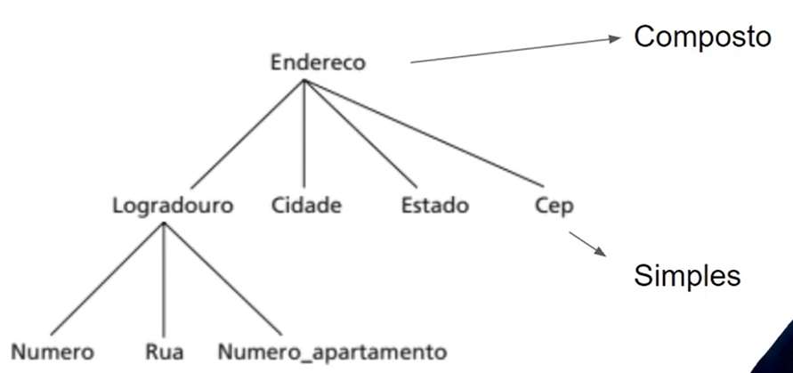
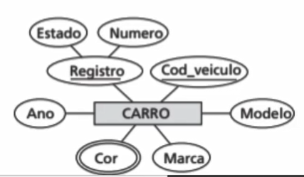

# ENTIDADES E ATRIBUTOS

## Entidades

Representa uma **coisa** ou **objeto** do mundo real com uma existência independente

A ENTIDADE pode possuir um existência **física** ou **conceitual**.

Cada ENTIDADE possui ATRIBUTOS. Eles **descrevem** a ENTIDADE.

## Atributos

Atributos **SIMPLES** ou **COMPOSTOS**.

Os atributos compostos podem ser **subpartes menores**, que representam atributos mais **básicos**.

Os atributos simples ou atômicos são **indivisíveis**.

Atributos **VALOR ÚNICO** ou **MULTIVALORADO**.

Atributo de valor único: Único valor.

Multivalorado: Podem ter mais de um valor associado a eles.

###### Exemplos:

    CARRO: Pode ter uma ou duas cores.

    FORMAÇÃO ACADÊMICA: Nenhuma, uma ou duas.

Atributos **ARMAZENADOS** ou **DERIVADOS**.

Atributos Armazenados: Tem o seu valor diretamente fornecido.

Atributos Derivados: Dependem de outros atributos ou entidades.

###### Exemplos:

    IDADE = DATA DE NASCIMENTO - DATA DE HOJE
    DATA DE NASCIMENTO = Atributo Armazenado.
    IDADE = Atributo Derivado de Data de Nascimento.

* Temos um relacionamento entre **FUNCIONÁRIO** e **DEPARTAMENTO**
O atributo **NUMERO DE FUNCIONÁRIOS** da entidade **FUNCIONÁRIO** pode ser
derivado da relação entre **FUNCIONÁRIO** e **DEPARTAMENTO**.

Atributos **DESCONHECIDOS** ou **NÃO APLICÁVEIS**.

CASA - Atributo número do apartamento = NULL (**Não aplicável**)

ALTURA - valor = NULL. Porque não sabemos, mas toda pessoa tem uma ALTURA.
Portanto ele é **Desconhecido**.

## Representação Gráfica

* **ENTIDADE**: Representada por um Retângulo.
* **ATRIBUTO**: Representada por um Circulo Oval.
* **ATRIBUTOS** e **ENTIDADE** são ligados por linhas retas.
* Os **ATRIBUTOS COMPOSTOS** são ligados a seus **ATRIBUTOS** por linhas retas.
* Os **ATRIBUTOS MULTIVALORADOS**: São representados por Círculos Ovais Duplos.
* **ATRIBUTOS CHAVES** são sublinhados.
* **ENTIDADES FRACAS** sem atributos Chaves.

