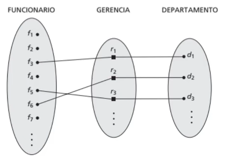

# CARDINALIDADE

## Definição

## Razão de Cardinalidade e Participação: (1:1, 1:N, N:1, N:M)

1:N ou N:N dependendo da definição de mini-mundo.

### 1:1 

### N:M

### Representação da Cardinalidade

* Tem a presentação da cardinalidade mínima
* Linha dupla, cardinalidade mínima é total
* Linha simples, cardinalidade mínima é parcial
* Existe outra forma de representar a cardinalidade mínima, seria com parenteses proximos aos losangos que representam as entidades, como por exemplo: (1,1), (0,1), (0,N), (1,N).

## Restrição de Participação e Dependências de Existência

Determinar a Cardinalidade Mínima das relações entre as entidades

Existem dois tipos:

**Total**: Dependência de Existência

    1 Funcionário - Trabalha Em - N Departamentos
    Funcionário só existe, se estiver em um ou mais departamentos

**Parcial**:

    1 Funcionário - Gerencia - 1 Projeto
    Um projeto existe sem um gerente, não
    Um funcionário existe sem gerenciar um projeto, sim