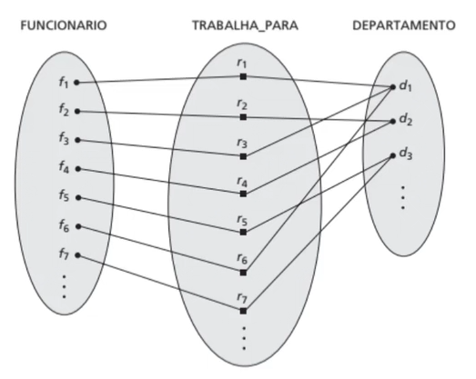

# RELACIONAMENTOS

## Grau de um Relacionamento

Número de entidades envolvidas no relacionamento.

Grau 2 - Binário - 2 Entidades
Grau 3 - Ternário - 3 Entidades

FUNCIONÁRIO - **TRABALHA EM** - DEPARTAMENTO : Binário.
FORNECEDOR - **FORNECE** - PEÇA - **PARA UM** - PROJETO : Ternário.

## Nome dos Pápeis

São os verbos que identificam o relacionamento.

FUNCIONÁRIO - **TRABALHA EM** - DEPARTAMENTO : Binário.
FORNECEDOR - **FORNECE** - PEÇA - **PARA UM** - PROJETO : Ternário.

**TRABALHA EM** e **FORNECE PARA UM** são nomes dos pápeis que identificam a ação associada ao relacionamento.

## Relacionamento Recursivo

FUNCIONÁRIO - **SUPERVISINA** - FUNCIONÁRIO

