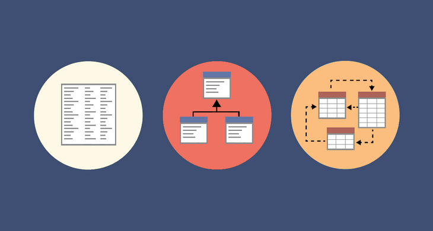

# Earthenware

Modelagem de dados é um processo de criação de um modelo de dados para que o dado de software seja gravado em um banco de dados. Nessa formação começaremos com **criação de diagramas de entidade relacionamento**, conhecer um banco de dados, **operações da álgebra relacional**. Também vamos ver o **mapeamento relacional**, **normalização** e mais. No final da formação, vamos conhecer um pouco da linguagem **SQL**, a linguagem usada para manipular os dados de um banco.

## Diagrama de ER e Modelo Relacional

Começamos os nossos estudos com o diagrama entidade relacionamento, vamos conhecer o que é um banco de dados, um SGDB, entidades, relacionamento, e etc. Seguindo, vamos aprender álgebra relacional, como seleção, projeção, união e diferença, depois vamos praticar um pouco tudo que estudamos.

## Transformação diagrama de ER para Relacional

Seguindo com a segunda parte, vamos aprender a mapear os relacionamentos, transformar um diagrama entidade-relacionamento em modelo relacional, em seguida vamos trabalhar com normalização para reduzir a redundância, integridade e desempenho dos dados. Ainda sobre normalização, vamos conhecer a forma Boyce-Coud, um formato pensando em tratar alguns tipos de anomalias no seu banco.

## Banco SGBD

Vamos começar a trabalhar com SQL, a linguagem usada para interagir com o banco dados. Vamos passar da instalação do MySQL, depois criar um banco dados baseado no modelo que trabalhamos e aprender as operações de inserção, deleção, atualização e seleção, no curso de NoSQL, vamo conhecer os problemas que aparece no mapeamento do modelo OO e relacional, vamos trabalhar com arquivos JSON e conhecer o banco de dados MongoDB.